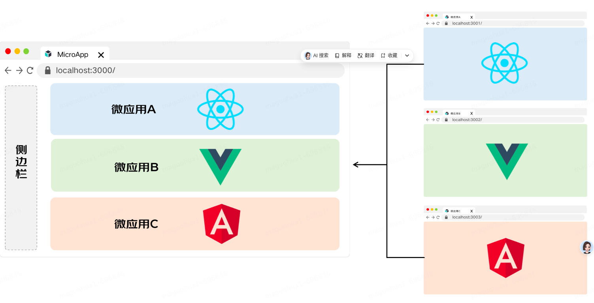
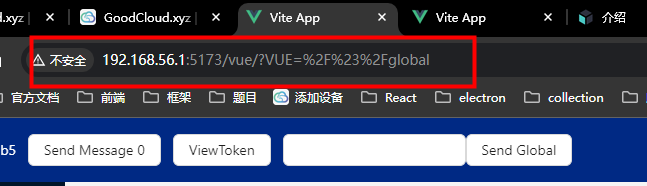

# 微前端学习以及分享

## 项目配置

### 启动项目

安装依赖
```bash
pnpm install
```

启动项目
```bash
pnpm dev
```

### 项目结构

- assets：静态资源
- base-app：基座应用（Vue3 + ts + vite）
- child-native-app: 原生子应用（html + css + js）
- child-react-app: react子应用（React + ts + vite）
- child-vue3-app: vue3子应用（Vue3 + ts + vite）
- servers：用于部署打包后的每个应用（暂时还没有应用起来，还需要适配）


## 什么是微前端

微前端的概念是由`ThoughtWorks`在2016年提出的，它借鉴了微服务的架构理念，核心在于将一个庞大的前端应用拆分成多个独立灵活的小型应用，每个应用都可以独立开发、独立运行、独立部署，再将这些小型应用融合为一个完整的应用，或者将原本运行已久、没有关联的几个应用融合为一个应用。微前端既可以将多个项目融合为一，又可以减少项目之间的耦合，提升项目扩展性，相比一整块的前端仓库，微前端架构下的前端仓库倾向于更小更灵活。

它主要解决了两个问题：

- 随着项目迭代应用越来越庞大，难以维护。
- 跨团队或跨部门协作开发项目导致效率低下的问题。




微前端架构有以下特点：

- 技术栈无关
  主框架不限制接入应用的技术栈，微应用具备完全自主权

- 独立开发、独立部署
  微应用仓库独立，前后端可独立开发，部署完成后主框架自动完成同步更新

- 增量升级

  在面对各种复杂场景时，我们通常很难对一个已经存在的系统做全量的技术栈升级或重构，而微前端是一种非常好的实施渐进式重构的手段和策略

- 独立运行时
  每个微应用之间状态隔离，运行时状态不共享


## 现有的微前端解决方案

现在主流的微前端解决方案有以下几种：

- `qiankun`：`qiankun` 孵化自蚂蚁金融科技基于微前端架构的云产品统一接入平台，在经过一批线上应用的充分检验及打磨后，我们将其微前端内核抽取出来并开源，希望能同时帮助社区有类似需求的系统更方便的构建自己的微前端系统。

- MicroApp：`micro-app`是由京东前端团队推出的一款微前端框架，它借鉴了`WebComponent`的思想，通过`js沙箱`、`样式隔离`、`元素隔离`、`路由隔离`模拟实现了隔离特性，从而实现微前端的组件化渲染，旨在降低上手难度、提升工作效率。

  `micro-app`和技术栈无关，也不和业务绑定，可以用于任何前端框架。

- `Wujie`：无界微前端方案基于 webcomponent 容器 + iframe 沙箱，能够完善的解决适配成本、样式隔离、运行性能、页面白屏、子应用通信、子应用保活、多应用激活、vite 框架支持、应用共享等用户的核心诉求。

目前而言，这三种方案都是不错的微前端解决方案，但是目前而言`qiankun`对vite的支持仍然不友好，`qiankun`本身是不支持vite构建的应用的，还需要使用社区的插件，而且我也有去做demo，然后觉得坑太多了，就选择了 `MicroApp` 方案来做微前端技术调研学习的方案。


## 学习目标

本次学习目标有以下几个：

- 设计微前端架构

- 实现基座应用和子应用之间的通信
- 不同子应用之间的通信
- 数据共享以及数据私有
- 部署整个微前端架构以及有关应用


## 基座和子应用

微前端架构中很重要的一个概念就是`基座和子应用`，基座就是整个应用的基础，所有的子应用就是一个个单独的前端应用（工程）。在微前端架构中，子应用是可以单独开发然后适配基座的，最终整个应用运行后，子应用是挂载在基座上的。

### 搭建基座和子应用

我们可以用任意的技术栈来搭建基座应用。由于我们现在目前以及后续的技术栈是 `vue3 + ts + vite` 这套。因此这里我也就以该技术栈搭建基座。

子应用我们可以使用各种技术栈搭建不同的子应用来进行技术实践，我这边准备了一下几种技术栈：

- `vue3 + ts + vite`
- `react + ts + vite`
- 原生`native app (使用nodejs搭建静态资源服务器)`

搭建基座应用和子应用的流程这里就无需多讲了。也不是本次分享的重点，因此这里略过。

### 初始化基座

首先是安装依赖：

```bash
npm i @micro-zoe/micro-app --save
// 或者
pnpm add @micro-zoe/micro-app
// 或者
yarn add @micro-zoe/micro-app
```

然后根据官方文档操作步骤，初始化基座的 `MicroApp` 有关的配置代码：

```ts
import microApp from "@micro-zoe/micro-app";

export function startMicro() {
    console.log("MicroApp start!");
    microApp.start();
}
```

这样子，我们的基座应用就初始化完成了，非常简单。

###  加载子应用

在基座应用中直接使用 `<micro-app>` 标签加载子应用：

```vue
<template>
  <!-- name：应用名称, url：应用地址 -->
  <micro-app name='my-app' url='http://localhost:3000/'></micro-app>
</template>

```

这里是以 `vue` 子应用为例，后续完整代码会有`react`版本的。这里注意`name`和`url`只是这个标签的属性之二，该标签还支持多种属性，后续我们遇到一个说一个。比如我们在加载 `vite` 构建的子应用就需要加上`iframe`属性。因为目前`vite`构建的子应用目前只支持 `iframe`沙箱。

##### 子应用TS配置

由于子应用无需安装 `micro-app` 依赖，并且子应用通过window对象实现微前端功能以及和基座应用之间的通信，因此我们最好是给子应用声明一下window对象上面的有关属性和方法：

`env.d.ts`:

```ts
/*
 * @Author: shufei.han
 * @Date: 2024-08-02 09:29:40
 * @LastEditors: shufei.han
 * @LastEditTime: 2024-08-29 12:05:55
 * @FilePath: \micro-frontend\child-vue3-app\env.d.ts
 * @Description: 
 */
/// <reference types="vite/client" />
import type { MicroMessageType } from '@/models/base.model';
import 'ant-design-vue/typings/global'

declare global {

    interface MicroMessage<T = any> {
        type: MicroMessageType;
        value?: T;
    }
    interface Window {
        microApp: {
            addDataListener:(dataListener: (data: MicroMessage) => any, autoTrigger?: boolean) => void;
            removeDataListener:(dataListener: (data: MicroMessage) => any, autoTrigger?: boolean) => void;
            removeGlobalDataListener:(dataListener: (data: MicroMessage) => any, autoTrigger?: boolean) => void;
            addGlobalDataListener:(dataListener: (data: MicroMessage) => any, autoTrigger?: boolean) => void;
            clearDataListener: () => void;
            getData: () => MicroMessage;
            dispatch: <T extends MicroMessage = MicroMessage, C extends Function>(data:T, cb?: C) => void;
            getGlobalData: () => MicroMessage;
            setGlobalData: <T extends MicroMessage = MicroMessage, C extends Function>(data:T, cb?: C) => void;
        };
        /** 应用名称 */
        __MICRO_APP_NAME__: string;
        /** 判断应用是否在微前端环境中 */
        __MICRO_APP_ENVIRONMENT__: boolean;
        /** 子应用的静态资源前缀 */
        __MICRO_APP_PUBLIC_PATH__: string;
        /** 子应用的基础路径 */
        __MICRO_APP_BASE_ROUTE__: string;
        /** 判断当前应用是否是主应用 */
        __MICRO_APP_BASE_APPLICATION__: string;
        /** 获取真实window（即主应用window） */
        rawWindow: Window;
        /** 获取真实document（即主应用document） */
        rawDocument: Document;
    }
}

export {}
```


### 子应用跨域配置

如果我们直接像上述配置一样直接接入子应用，由于浏览器的同源策略，如果子应用不支持跨域，则会报跨域错误。因此我们需要在子应用所在的 `web server` 进行跨域配置：

`vite`配置：

```ts
export default defineConfig({
  server: {
    headers: {
      'Access-Control-Allow-Origin': '*',
    }
  }
})
```

`nodejs`配置（我的`nodejs`是使用`express`搭建的静态资源服务，因此这里以该技术栈举例）：

```ts
 private setCors() {
        this.instance.use((req, res, next) => {
            res.header("Access-Control-Allow-Origin", "*");
            res.header("Access-Control-Allow-Headers", "Origin, X-Requested-With, 								Content-Type, Accept");
            next();
        });
    }
```


### 环境变量

`Micro App`提供了一下环境变量，用于我们开发过程中的某些环境有关的逻辑判断，这些环境变量大多都通过绑定为 `window` 对象的属性的方式来使用，因此如果我们使用`Typescript`开发子应用的话，就要进行这些全局变量的变量声明，我们在我们子应用中的声明文件（`vite`构建的应用的默认声明文件就是根目录下面的`env.d.ts`）：

```ts
/// <reference types="vite/client" />

declare global {
    interface Window {
        /** 应用名称 */
        __MICRO_APP_NAME__: string;
        /** 判断应用是否在微前端环境中 */
        __MICRO_APP_ENVIRONMENT__: boolean;
        /** 子应用的静态资源前缀 */
        __MICRO_APP_PUBLIC_PATH__: string;
        /** 子应用的基础路径 */
        __MICRO_APP_BASE_ROUTE__: string;
        /** 判断当前应用是否是主应用 */
        __MICRO_APP_BASE_APPLICATION__: string;
        /** 获取真实window（即主应用window） */
        rawWindow: Window;
        /** 获取真实document（即主应用document） */
        rawDocument: Document;
    }
}

export {}
```


### 生命周期

`micro-app`通过`CustomEvent`定义生命周期，在组件渲染过程中会触发相应的生命周期事件。

#### 生命周期列表

1. created：
   <micro-app>标签初始化后，加载资源前触发。

2. beforemount：
   加载资源完成后，开始渲染之前触发。
3. mounted：
   子应用渲染结束后触发。
4. unmount：
   子应用卸载时触发。
5. error：
   子应用加载出错时触发，只有会导致渲染终止的错误才会触发此生命周期。

#### 监听方式

`Vue`：

```tsx
<micro-app
  name='xx'
  url='xx'
  onCreated={() => console.log('micro-app元素被创建')}
  onBeforemount={() => console.log('即将渲染')}
  onMounted={() => console.log('已经渲染完成')}
  onUnmount={() => console.log('已经卸载')}
  onError={() => console.log('加载出错')}
/>

```

`React`:

因为React不支持自定义事件，所以我们需要引入一个`polyfill`。

`在标签所在的文件顶部` 添加`polyfill`，注释也要复制。

```tsx
/** @jsxRuntime classic */
/** @jsx jsxCustomEvent */
import jsxCustomEvent from '@micro-zoe/micro-app/polyfill/jsx-custom-event'

<micro-app
  name='xx'
  url='xx'
  onCreated={() => console.log('micro-app元素被创建')}
  onBeforemount={() => console.log('即将渲染')}
  onMounted={() => console.log('已经渲染完成')}
  onUnmount={() => console.log('已经卸载')}
  onError={() => console.log('加载出错')}
/>

```


### 数据通信

数据通信这一节的内容在微前端的领域非常重要，这关乎着各个子应用之间，以及子应用与主应用之间如何进行数据通信。

数据通信主要分为以下几种：

- 主应用向子应用发送数据
- 子应用向主应用发送数据
- 各个子应用之间的互相通信

#### 主应用向子应用发送数据

主应用给子应用传递数据有两种方式：

1. 通过data属性发送数据
2. 通过方法手动发送数据

##### 通过data属性发送数据

data作为 `micro-app` 标签的属性，用该属性作为主应用向子应用传递数据的中介：

```
<micro-app :name="SubApps.REACT" @created="created" :data="data" keep-alive url="http://localhost:4003/" iframe  @datachange="handleChange"></micro-app>


const data = ref<MicroMessage>({
    type: MicroMessageType.TEXT_MSG,
    value: 'This is a initial TextMessage'
})
    
onMounted(() => {
	setInterval(() => {
    data.value.value = 'new value'
    }, 1000)    
})
```

这种方式类似于我们平时组件中的父子组件传参，区别就是，在子应用中需要通过`getData`方法区手动获取数据，该数据不是全响应式的（基座中绑定的数据如果发生变化会动态更改传给子应用的值，但是子应用需要通过`getData`方法手动获取更改后的值。）。

子应用：

```ts
const data = window.microApp.getData()
```

##### 通过`microApp.setData`方法发送数据

除了通过data属性传递数据，还可以通过`microApp.setData`方法动态发送数据：

```ts
microApp.setData(name, message)
```

这两种方法是有区别的，第一种方法只能通过`getData`方法去手动的获取数据，数据更新时子应用是无感知的。而第二种方法类似于发布订阅机制，子应用可以随时监听到数据变化。

##### 子应用通过注册事件监听数据

子应用可以使用`window.microApp.addDataListener`方法监听来自主应用的事件消息：

```ts
window.microApp.addDataListener((data: MicroMessage) => {
    handleMessage(data)
})
```

我们在收到消息后通过`handleMessage`方法来统一处理消息。

**这里建议：虽然`microApp`只要求我们的消息格式是 `Object` 就可以，但是我这边建议，我们需要对消息进行一个统一的格式管理，方便维护。**

比如我这边利用`TS`的特性，对基座和子应用之间的消息进行枚举，然后再定义接口来约束消息的格式，这样基座和子应用之间处理消息的时候根据消息类型来去做对应的处理逻辑：

```ts
// 对消息类型进行枚举
export enum MicroMessageType {
  CHANGE_THEME = 'change_theme',
  SET_COUNT = 'set_count',
  TEXT_MSG = 'text_msg',
}

// 约束来基座和子应用之间通信的消息格式
interface MicroMessage<T = any> {
    type: MicroMessageType;
    value?: T;
}
```

总的来说：通过data属性传递数据和通过发布订阅的模式（消息事件监听）传递数据是有区别的，在实际场景中根据自己需要选取使用。

#### 子应用向主应用发送数据

在微前端种，不仅有主应用向子应用发送消息的场景，通常也可能会有子应用向主应用发送消息的场景，在
`micro-app` 中，子应用通过 `window.microApp.dispatch`方法发送数据，这里同样为了约束子应用向主应用发送的数据的格式，我们可以在声明文件中约定子应用推送消息的格式：

```ts
dispatch: <T extends MicroMessage = MicroMessage, C extends Function>(data:T, cb?: C) => void
```

然后我们就可以定义一个公用的方法用来向主应用发送数据：

```ts
export const sendMessageToBase = (message: MicroMessage) => {
    window.microApp.dispatch(message)
}

// 使用
const handleSend = () => {
    sendMessageToBase({
        type: MicroMessageType.TEXT_MSG,
        value: {value},
    });
};
```


### 全局数据通信

全局数据通信会向主应用和所有子应用发送数据，在跨应用通信的场景中适用。

主应用发送数据:

```ts
import microApp from "@micro-zoe/micro-app";

export const sendGlobalData = (message: MicroMessage) => {
    microApp.setGlobalData(message)
}
```

子应用发送数据:

```ts
// setGlobalData只接受对象作为参数
window.microApp.setGlobalData({type: '全局数据'})
```

主应用获取数据：

```ts
microApp.addGlobalDataListener((msg) => {
        Modal.info({title:`BaseApp收到全局数据`, content: JSON.stringify(msg), 									centered:true})
        mainStore.setGlobalMessages(msg)
}
                               
// 或者使用getGlobalData手动获取数据
const data = microApp.getGlobalData()
```

子应用获取数据：

```ts
window.microApp.addGlobalDataListener((data) => {
    handleGlobalMessage(data)
})

// 或者使用getGlobalData手动获取数据
const data = window.microApp.getGlobalData()
```


### 虚拟路由系统

`MicroApp`通过拦截浏览器路由事件以及自定义的`location`、`history`，实现了一套虚拟路由系统，子应用运行在这套虚拟路由系统中，和主应用的路由进行隔离，避免相互影响。**建议全局配置路由模式：**

```ts
microApp.start({
    'router-mode':'native'
});
```

`MicroApp` 提供一下这几种路由模式：

- search模式
- native模式
- native-scope模式
- pure模式
- state模式

这里就不详细说明这些路由模式了，这里只说常用的两种：

#### search模式路由

search是默认模式，通常不需要特意设置，search模式下子应用的路由信息会作为query参数同步到浏览器地址上。这种模式最简单也不需要去做其他的配置。

但是这种模式的路由，在页面上看起来会很奇怪，不建议使用。



#### native模式路由

native模式是指放开路由隔离，子应用和主应用共同基于浏览器路由进行渲染，它拥有更加直观和友好的路由体验，但配置方式更加复杂。需要基于`vue-router`的`base`配置或者`react-router`的`basename`配置：

##### `Vue3`中的配置方法：

我们使用`4.x版本的vue-router`，在生成路由的方法`createWebHashHistory`中传入`base`配置：

```ts
history: createWebHashHistory(import.meta.env.VITE_BASE_URL)
```

这里需要注意这里配置的`base`需要和主应用中的该子应用的`routerPath`保持一致，因此推荐使用另一种方法来设置而非通过环境变量：

```ts
<micro-app :name="SubApps.VUE" @created="created" url="http://192.168.8.125:4002/"  baseroute="/vue/" iframe @datachange="handleChange"></micro-app>

// router/index.ts
const router = createRouter({
	..............
    history: createWebHashHistory(window.__MICRO_APP_BASE_ROUTE__ || '/'),
    ..............
}
```

##### React中使用

可以根据[官方文档](https://micro-zoe.github.io/micro-app/docs.html#/zh-cn/native-mode)进行配置。

注意：根据子应用和主应用不同的路由模式，我们可能需要进行不同的配置或者不需要配置，具体查阅官方文档。

## 总结

本次分享是对自己学习`MicroApp`的过程的一个分享，本次demo也只是一个非常基础的demo，微前端架构需要考虑的内容还很多，需要再实战中遇到问题再积累总结。

